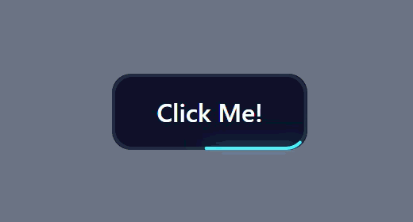
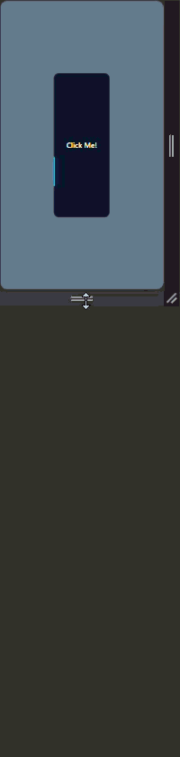
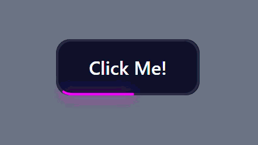
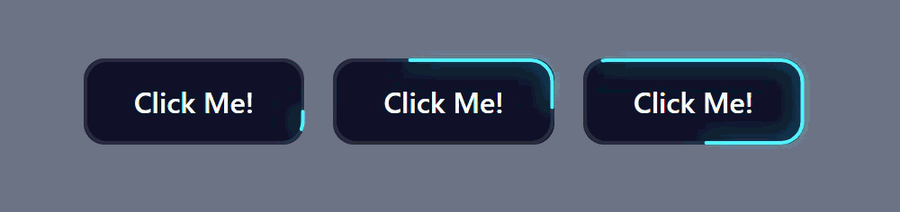
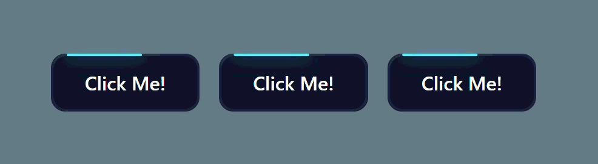

# LaserButton

A **single-file React + TypeScript** component that creates a responsive animated laser border using SVG.

No external CSS file. Just copy **one `.tsx` file** into your project and use it.

---

## Preview

### Default Animation



### Responsive Resize



---

## Features

- ⚡ Smooth SVG laser animation
- 📏 Automatically adapts to any button size
- 🎨 Custom laser colors
- ✨ Adjustable beam length
- ⏱ Configurable animation speed
- 📦 Single-file component
- ♻️ Supports all native HTML button props
- 🎯 `forwardRef` support

---

# Installation

## Option 1 — Copy & Paste (Recommended)

Copy the file below into your project:

```text
src/components/LaserButton.tsx
```

Then import it:

```tsx
import { LaserButton } from "@/components/LaserButton";

export default function App() {
  return (
    <LaserButton>
      Get Started
    </LaserButton>
  );
}
```

That's it. No CSS files, no additional setup.

---

## Option 2 — Clone the Repository

```bash
git clone https://github.com/Devashish-Belwal/LaserButton
```

The component lives here:

```text
src/components/LaserButton.tsx
```

Copy it into your own project.

---

# Usage

### Default

```tsx
<LaserButton>
  Continue
</LaserButton>
```

### Custom Color

```tsx
<LaserButton laserColor="#8B5CF6">
  Explore
</LaserButton>
```

### Longer Beam

```tsx
<LaserButton beamLength={100}>
  Download
</LaserButton>
```

### Faster Animation

```tsx
<LaserButton animationDuration="1.2s">
  Launch
</LaserButton>
```

### Everything Combined

```tsx
<LaserButton
  laserColor="#22C55E"
  beamLength={80}
  animationDuration="1.5s"
>
  Start Now
</LaserButton>
```

---

# Props

| Prop | Type | Default | Description |
|------|------|---------|-------------|
| `beamLength` | `number` | `60` | Visible laser length in pixels |
| `laserColor` | `string` | `#00f0ff` | Laser color and glow |
| `animationDuration` | `string` | `"2.5s"` | Time for one complete loop |
| `className` | `string` | — | Additional classes |
| `...props` | `ButtonHTMLAttributes<HTMLButtonElement>` | — | All native button props |

---

# How It Works

The border is drawn using two identical SVG rectangles:

- **Track** → static border
- **Beam** → animated laser

The component measures the exact perimeter of the SVG using `getTotalLength()`, then updates it automatically with `ResizeObserver`, ensuring the animation stays accurate even when the button resizes.

---

# Project Structure

```text
src/
└── components/
    └── LaserButton.tsx
```

The repository also includes a small playground used to demonstrate the component, but the component itself is completely self-contained.

---

# Tech Stack

- React 19
- TypeScript
- SVG Stroke Animations
- CSS Variables
- ResizeObserver
- forwardRef

---

# Demo Placeholders

| Demo |              |
|------|--------------|
| Default animation |
| Responsive resize |
| Custom colors |
| Beam length comparison |
| Animation speed comparison |

---

## License

MIT
